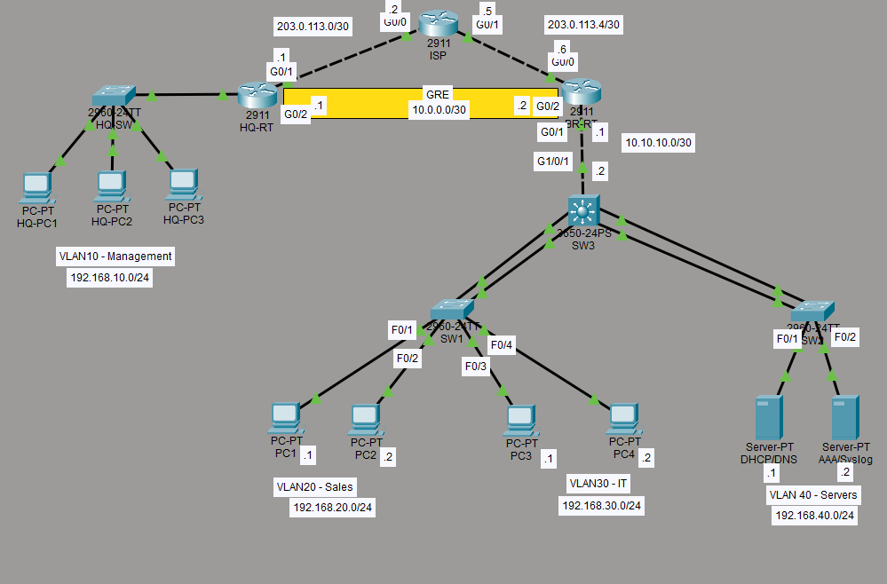

# Small Enterprise Branch Network Lab

**Tools:** Cisco Packet Tracer | **Cert Level:** CCNA  
**Topics:** OSPF · GRE Tunneling · VLANs · VTP · EtherChannel · DHCP/DNS · NAT · ACLs · Port Security · SSH · AAA

---

## Scenario

A small company has two sites — a headquarters and a branch office. As the network engineer, I was tasked with designing and implementing a fully functional network from scratch. The branch office needed department segmentation, secure management access, internal services, and NAT to reach the internet. Both sites needed to exchange routes dynamically over a simulated WAN connection.

This lab simulates that environment end-to-end in Cisco Packet Tracer.

---

## Topology



| Site | Devices |
|------|---------|
| HQ | 2911 Router (HQ-RTR), 2960 Switch (HQ-SW), 3x PCs |
| Branch | 2911 Router (BR-RTR), 3560 MLS (Core, SW3), 2x 2960 Access Switches (SW1, SW2), 2x Servers, 4x PCs |
| Simulated Internet | ISP Router (2911) |

---

## IP Addressing

### WAN Links

| Link | Device | Interface | IP Address |
|------|--------|-----------|------------|
| ISP ↔ HQ | ISP-RTR | (facing HQ) | 203.0.113.2/30 * |
| | HQ-RTR | G0/1 | 203.0.113.1/30 |
| ISP ↔ Branch | ISP-RTR | (facing Branch) | 203.0.113.5/30 * |
| | BR-RTR | G0/0 | 203.0.113.6/30 |

\* *ISP-side addressing inferred from each router's default route target — not independently verified from the ISP router's own config.*

### GRE Tunnel (HQ ↔ Branch, carries OSPF)

| Device | Interface | IP | Tunnel Source | Tunnel Destination |
|--------|-----------|----|----|----|
| HQ-RTR | Tunnel0 | 10.0.0.1/30 | G0/1 | 203.0.113.6 |
| BR-RTR | Tunnel0 | 10.0.0.2/30 | G0/0 | 203.0.113.1 |

Simulates a site-to-site WAN connection that would, in a real deployment, run as a GRE/IPsec tunnel over the ISP's infrastructure. GRE-only is used here since IPsec configuration is beyond CCNA scope.

### Internal Backbone

| Link | Device | Interface | IP |
|------|--------|-----------|-----|
| BR-RTR ↔ Core Switch | BR-RTR | G0/1 | 10.10.10.1/30 |
| | CORE-SW (SW3) | G1/0/1 (routed port, `no switchport`) | 10.10.10.2/30 |
| HQ-RTR ↔ HQ-SW | HQ-RTR | G0/0 | 192.168.10.254/24 (gateway) |

HQ-RTR to HQ-SW is a plain **access port** (VLAN 10 only) — HQ has a single VLAN so trunking isn't needed there.

### VLANs

| VLAN | Name | Site | Subnet | Gateway (last usable) | DHCP |
|------|------|------|--------|------|------|
| 10 | Management | HQ | 192.168.10.0/24 | 192.168.10.254 | Yes |
| 20 | Sales | Branch | 192.168.20.0/24 | 192.168.20.254 | Yes |
| 30 | IT | Branch | 192.168.30.0/24 | 192.168.30.254 | Yes |
| 40 | Servers | Branch | 192.168.40.0/24 | 192.168.40.254 | No — static only |

*Gateway convention: last usable address in each subnet, per team preference.*

### Servers

| Device | IP | Services |
|--------|----|----------|
| SRV-1 | 192.168.40.1 | DHCP, DNS |
| SRV-2 | 192.168.40.2 | AAA (TACACS+), Syslog |

---

## Technologies Implemented

### Switching
- VLANs 10 (HQ), 20/30/40 (Branch) with 802.1Q trunking between Branch switches
- **VTP** — domain `CORP`, Core switch (SW3) as server, both Branch access switches as clients. VTP does not cross HQ-RTR/BR-RTR, so HQ-SW's VLAN is configured manually — VTP only operates within a single Layer 2 domain.
- **EtherChannel (LACP)** — Port-Channel 1 (SW3 ↔ SW1) and Port-Channel 2 (SW3 ↔ SW2), two links each
- **STP** — root bridge manually set on CORE-SW (`spanning-tree vlan 10,20,30,40 priority 4096`) as best practice. The current topology has no redundant Layer 2 paths, so STP isn't actively preventing a loop right now — this is forward-looking configuration in case redundant links are added later.
- Port security on all Branch and HQ access ports: `switchport port-security` + sticky MAC learning. Maximum (1) and violation action (shutdown) are IOS defaults and don't print in `show run`, but are in effect.

### Routing
- Inter-VLAN routing via Layer 3 SVIs on the Core switch
- **OSPF Area 0** runs on three devices: HQ-RTR, BR-RTR, and the Core switch — not just the routers. The Core switch advertises its own VLAN subnets directly rather than relying on static routes from BR-RTR.
- Router IDs: HQ-RTR = 1.1.1.1, BR-RTR = 2.2.2.2, CORE-SW = 3.3.3.3
- OSPF runs over the GRE tunnel between HQ-RTR and BR-RTR, and over the routed link between BR-RTR and the Core switch
- Static default routes on HQ-RTR and BR-RTR pointing to the ISP
- Passive-interface applied to all end-host/VLAN-facing interfaces; active only on links that actually need an OSPF adjacency

### Network Services
- DHCP pools on SRV-1, scoped per VLAN (10, 20, 30) — VLAN 40 uses static IPs only since it's server infrastructure
- `ip helper-address 192.168.40.1` configured on HQ-RTR (G0/0) and on the Core switch's VLAN 20/30 SVIs, relaying DHCP broadcasts to SRV-1 across VLANs
- DNS A-records on SRV-1 — `srv1.branch.local` → 192.168.40.1, `srv2.branch.local` → 192.168.40.2
- PAT/NAT overload on BR-RTR — Branch hosts reach the simulated internet via `203.0.113.6`. HQ egresses independently through its own default route on HQ-RTR (NAT not yet configured there — see Known Gaps)
- **Syslog** — service enabled on SRV-2, but neither router currently has a `logging` command pointing to it, so nothing is actually being forwarded yet (see Known Gaps)

### Security
- **BLOCK_MANAGEMENT** ACL (extended, applied inbound on HQ-RTR G0/0): permits DNS (UDP 53) to SRV-1, denies access to IT (VLAN 30) and Servers (VLAN 40), denies outbound SSH (TCP 22) to anywhere, permits everything else
- **BLOCK_SALES** ACL (extended, defined on SW3): same pattern — permits DNS to SRV-1, denies IT and Servers, denies outbound SSH, permits everything else. **Not yet applied to an interface — see Known Gaps.**
- IT (VLAN 30) has unrestricted access by design — no ACL applied
- Port security: sticky MAC learning active on all access ports, real MAC addresses learned and confirmed
- **SSH v2** enabled on HQ-RTR and BR-RTR — RSA 2048-bit keys, `ip ssh version 2`, Telnet disabled automatically via `transport input ssh`
- **AAA** — TACACS+ via SRV-2, with local fallback if the server is unreachable. VTY lines use the `default` method list (`group tacacs+ local`). Console lines currently also inherit this same `default` list rather than a dedicated local-only override — see Design Decisions for the reasoning behind leaving this as-is.

---

## Key Configuration Snippets

### GRE Tunnel
```
! HQ-RTR
interface tunnel0
 ip address 10.0.0.1 255.255.255.252
 tunnel source g0/1
 tunnel destination 203.0.113.6

! BR-RTR
interface tunnel0
 ip address 10.0.0.2 255.255.255.252
 tunnel source g0/0
 tunnel destination 203.0.113.1
```

### OSPF — HQ-RTR
```
router ospf 1
 router-id 1.1.1.1
 passive-interface GigabitEthernet0/0
 network 10.0.0.0 0.0.0.3 area 0
 network 192.168.10.0 0.0.0.255 area 0
```

### OSPF — BR-RTR
```
router ospf 1
 router-id 2.2.2.2
 network 10.0.0.0 0.0.0.3 area 0
 network 10.10.10.0 0.0.0.3 area 0
```

### OSPF — CORE-SW
```
router ospf 1
 router-id 3.3.3.3
 network 10.10.10.0 0.0.0.3 area 0
 network 192.168.20.0 0.0.0.255 area 0
 network 192.168.30.0 0.0.0.255 area 0
 network 192.168.40.0 0.0.0.255 area 0
 passive-interface Vlan20
 passive-interface Vlan30
 passive-interface Vlan40
```

### NAT/PAT (BR-RTR)
```
ip access-list standard NAT_ACL
 permit 192.168.20.0 0.0.0.255
 permit 192.168.30.0 0.0.0.255
 permit 192.168.40.0 0.0.0.255

ip nat inside source list NAT_ACL interface GigabitEthernet0/0 overload

interface GigabitEthernet0/0
 ip nat outside
interface GigabitEthernet0/1
 ip nat inside
```

### Inter-VLAN SVIs + DHCP Relay (CORE-SW)
```
interface vlan 20
 ip address 192.168.20.254 255.255.255.0
 ip helper-address 192.168.40.1

interface vlan 30
 ip address 192.168.30.254 255.255.255.0
 ip helper-address 192.168.40.1

interface vlan 40
 ip address 192.168.40.254 255.255.255.0
```

### SSH (both routers)
```
ip domain-name branch.local
crypto key generate rsa modulus 2048
ip ssh version 2
username admin privilege 15 secret Cisco123!

line vty 0 4
 login authentication default
 transport input ssh
```

### AAA (both routers)
```
aaa new-model
aaa authentication login default group tacacs+ local

tacacs-server host 192.168.40.2
tacacs-server key CISCOKEY
```

### ACL — BLOCK_MANAGEMENT (HQ-RTR, G0/0 inbound)
```
ip access-list extended BLOCK_MANAGEMENT
 permit udp 192.168.10.0 0.0.0.255 host 192.168.40.1 eq domain
 deny ip 192.168.10.0 0.0.0.255 192.168.30.0 0.0.0.255
 deny ip 192.168.10.0 0.0.0.255 192.168.40.0 0.0.0.255
 deny tcp 192.168.10.0 0.0.0.255 any eq 22
 permit ip any any

interface GigabitEthernet0/0
 ip access-group BLOCK_MANAGEMENT in
```

### ACL — BLOCK_SALES (SW3)
```
ip access-list extended BLOCK_SALES
 permit udp 192.168.20.0 0.0.0.255 host 192.168.40.1 eq domain
 deny ip 192.168.20.0 0.0.0.255 192.168.30.0 0.0.0.255
 deny ip 192.168.20.0 0.0.0.255 192.168.40.0 0.0.0.255
 deny tcp 192.168.20.0 0.0.0.255 any eq 22
 permit ip any any

interface vlan 20
 ip access-group BLOCK_SALES in
```

## Verification

| Test | Command | Expected Result |
|------|---------|-----------------|
| VLANs active | `show vlan brief` | Correct VLANs active on correct ports |
| VTP syncing | `show vtp status` | Matching domain/revision across switches |
| EtherChannel up | `show etherchannel summary` | Po1, Po2 in P state |
| OSPF neighbors (BR-RTR) | `show ip ospf neighbor` | FULL with HQ-RTR (Tunnel0) and CORE-SW (G0/1) |
| OSPF routes | `show ip route` | All remote subnets present as `O` routes on every router/switch |
| NAT working | `show ip nat translations` | Active entries after Branch host pings something beyond the default route (e.g. the ISP's own interface) |
| DHCP leases | `show ip dhcp binding` | Leases assigned per VLAN |
| DNS resolution | `ping srv1.branch.local` | Resolves and replies from 192.168.40.1 |
| ACL — Sales blocked from IT/Servers | Sales PC pings IT/Server subnet | **Currently passes through unblocked — ACL not applied yet** |
| ACL — Management blocked from IT/Servers | Management PC pings IT/Server subnet | Request timed out |
| SSH login | `ssh -l admin <router-ip>` from an IT PC | Prompts for password, authenticates via TACACS+ |
| AAA fallback | Same, with SRV-2 powered off/unreachable | Falls back to local credentials |
| Port security | `show port-security interface fa0/1` | Sticky MAC learned, port up |

---

## Design Decisions

**Why a GRE tunnel instead of a direct cable between HQ and Branch?**  
A direct physical link would have been a simplification I felt. A GRE tunnel running over the simulated ISP demonstrates the actual concept used in real WAN deployments — the two routers behave as if directly connected while traffic is encapsulated across the provider network. Full GRE-over-IPsec was considered but left out given Packet Tracer's IPsec support seemed non-existent.

**Why OSPF on the Core switch instead of static routes on BR-RTR?**  
Felt an OSPF on the Core switch is more realistic for an enterprise environment and demonstrates configuring OSPF on a multilayer switch, not just routers.

**Why a dedicated Server VLAN (40)?**  
Separating servers into their own VLAN allows independent ACL policies on server traffic, follows standard network segmentation practice, and avoids servers being affected by port security rules meant for end-user devices.

**Why does IT have unrestricted (`permit ip any any`) access while Sales/Management are restricted?**  
Reflects IT's role managing the network and servers. In a real enterprise this would typically be scoped further — limited to specific management protocols (RDP/3389, WinRM/5985, SSH/22, SMB/445) rather than full IP access, following least-privilege principles. Full access was used here for lab simplicity since Packet Tracer's PCs don't run any services to actually demonstrate scoped remote management against.

**Why don't Sales/Management get ping replies back when IT initiates contact?**  
The ACLs are stateless — a deny rule blocking traffic in one direction also blocks the reply, since the reply itself matches the same source/destination pair. This was a deliberate scope decision: fixing it fully requires something stateful (reflexive ACLs or a zone-based firewall), so perhaps if I come back to this I may implement but for the purposes of this lab to show my understanding of CCNA priciples I left it out. A narrow ICMP echo-reply permit would patch ping specifically but not other protocols, so I left it out entirely as I felt it would have been halfway to actually setting up a reflexive ACL.

**Why does the console line share the same AAA method list as SSH, instead of a dedicated local-only override?**  
Once `aaa new-model` is enabled, any line without an explicit override inherits the `default` method list automatically — this is what caused a full lockout earlier in the build. The safer pattern is a dedicated method list (e.g. `aaa authentication login CONSOLE local`) applied directly to `line con 0`, bypassing TACACS+ entirely for console access. This was evaluated and intentionally deferred: the current setup is functional and TACACS+ has been reliable in testing, so the fix was deprioritized in favor of finishing the build. It remains a known, understood trade-off rather than an oversight.

**Why /24 subnets on VLANs, and the last-usable address as the gateway?**  
/24 provides flexibility for future growth while keeping addressing simple and consistent. Last-usable gateway is a team convention rather than the more common first-usable — both are valid, this was just a documented choice.

---

## Known Gaps

- [ ] Appears `BLOCK_SALES` to the Core switch's VLAN 20 SVI (`ip access-group BLOCK_SALES in`) — defined but not showing in running config. However, it appears the ACL is working as it is working as intended given tested pings.

---

## Files

| File | Description |
|------|-------------|
| `enterprise-branch.pkt` | Packet Tracer file |
| `configs/` | Individual device configs, exported as .txt |
| `screenshots/` | Verification outputs and topology diagram |

---

*Lab built as post-CCNA practice in Cisco Packet Tracer.*
